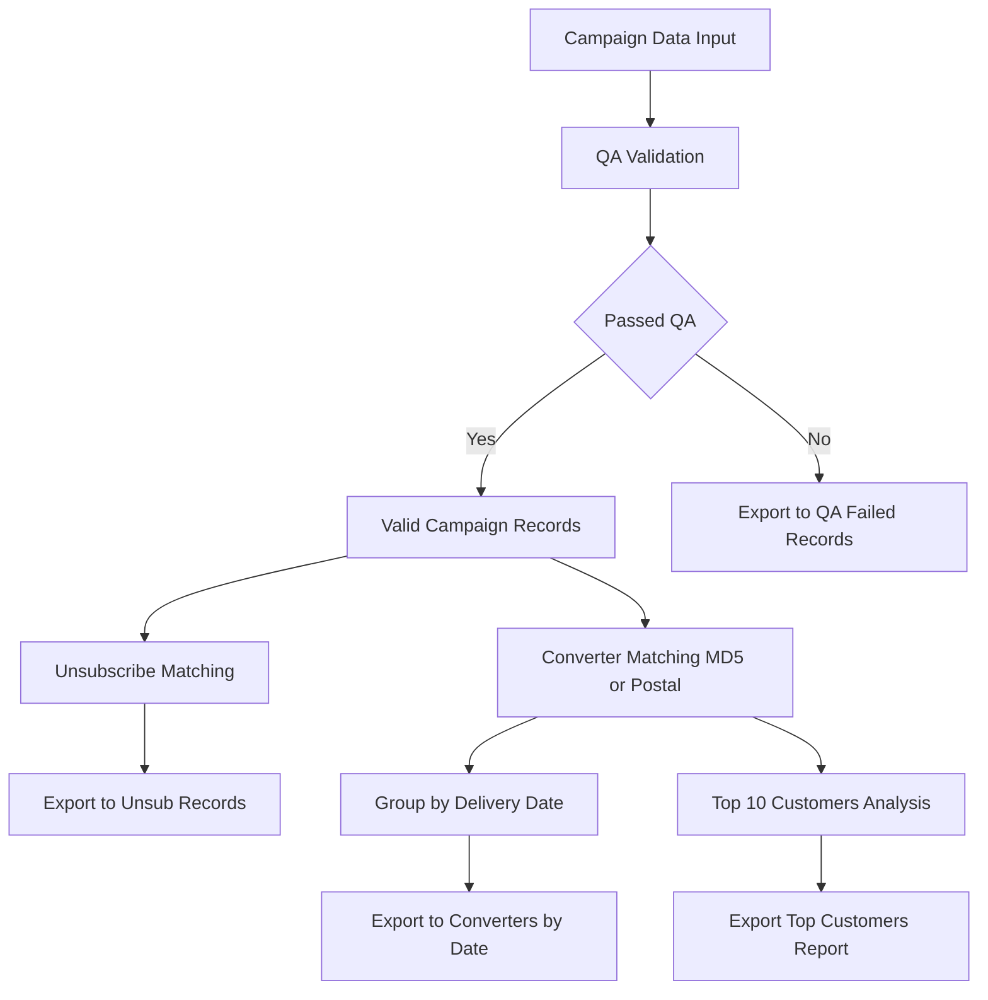

# 📧 EMAIL MARKETING ANALYTICS PIPELINE

### *A Fully Alteryx-Based Workflow for Campaign QA, Converter Tracking & Customer Analysis*

#### **By Avinash Rai – Alteryx Workflow Developer | Marketing Intelligence Analyst**

---

## 🎯 PROJECT OBJECTIVE

> **Build a visual, robust, and fully automated email analytics pipeline using Alteryx Designer to:**

* ✅ Perform 4-stage data validation on campaign files
* ✅ Identify real customer converters via MD5 & postal-level matching
* ✅ Detect and extract unsubscribed users
* ✅ Rank top 10 customers by order volume
* ✅ Generate & email structured CSV and PDF reports

All steps are developed and executed **entirely within Alteryx — zero external scripting**.

---

## 📊 DATASETS INTEGRATED

| Dataset           | Description                                    | Source |
| ----------------- | ---------------------------------------------- | ------ |
| **Campaign Data** | Records of emails delivered, opened, clicked   | Client |
| **Master Data**   | Master MD5 email hash list                     | Client |
| **Customer Data** | Customer purchases with CUST\_NO, postal, date | Client |

---

## 🔐 4-STAGE DATA QUALITY VALIDATION

Every record must pass **4 critical checks** before further processing. Failed records are logged in `qa_failed_records.csv`.

| 🔍 Check Type        | Description                                                          |
| -------------------- | -------------------------------------------------------------------- |
| 1️⃣ Master MD5 Match | Ensure records exist in the **Master Data** using `MD5` hash         |
| 2️⃣ Duplicate Check  | Ensure **no duplicate** MD5 values exist                             |
| 3️⃣ Non-empty MD5    | **Exclude blank or null MD5 values**                                 |
| 4️⃣ Date Hierarchy   | **Click ≥ Open ≥ Delivery**. Validate the logical email journey flow |

> 📤 **Output:** All failures exported to `qa_failed_records.csv` with: `MD5, Del Date, Open Date, Click Date, Unsub Date`.

---

## 📤 UNSUBSCRIBED USER HANDLING

| Step | Logic                                                                                 |
| ---- | ------------------------------------------------------------------------------------- |
| 1️⃣  | Match campaign data to Master Data on `MD5` hash                                      |
| 2️⃣  | Extract only those with a valid `Unsubscribed Date`                                   |
| 3️⃣  | Output unsubscribed list to `unsub_records.csv` with `MD5, Delivery Date, Unsub Date` |

---

## 🎯 CONVERTER IDENTIFICATION LOGIC

Records passing QA are matched to **Customer Data** using dual strategies:

| Match Level     | Fields Used             | Window Logic                               |
| --------------- | ----------------------- | ------------------------------------------ |
| 🧠 MD5 Match    | `Email MD5`             | Delivery Date ≤ Conversion Date ≤ +30 Days |
| 📫 Postal Match | `Postal Code + Address` | Same 30-day logic applies                  |

✔ **Converters are grouped and exported by delivery date** as:
📂 `converters_del_date_YYYYMMDD.csv`

---

## 🧮 TOP 10 CUSTOMER ANALYSIS

Ranks customers by **total unique orders** placed within the campaign window.

| Step | Action                                                            |
| ---- | ----------------------------------------------------------------- |
| 1️⃣  | Group by `CUST_NO`                                                |
| 2️⃣  | Count distinct `ORDER_NO`                                         |
| 3️⃣  | Sort and filter top 10 customers                                  |
| 4️⃣  | Output file: `top_10_customers.csv` with `CUST_NO, ORDER_NO list` |

---

## 🛠 ALTERYX WORKFLOW BREAKDOWN

🧩 **All logic implemented with native Alteryx tools**: Formula, Join, Filter, Unique, Summarize, Output Data, and Render.

---

## 📬 REPORT OUTPUTS & DELIVERY

| Report               | Format        | Frequency | Delivery Tool       |
| -------------------- | ------------- | --------- | ------------------- |
| Failed QA Summary    | CSV           | Daily     | Output tool         |
| Converter Reports    | CSV (by date) | Daily     | Output tool         |
| Unsubscribed Users   | CSV           | Daily     | Output tool         |
| Top Customers        | CSV           | Weekly    | Output tool         |
| Full Campaign Report | PDF           | On Demand | Alteryx Render Tool |

> 🔁 You can optionally **schedule workflows** using Alteryx Scheduler for full automation.

---

## 📈 RESULTS & IMPACT

| Goal                       | Achieved Outcome                         |
| -------------------------- | ---------------------------------------- |
| Automate QA & cleansing    | 98%+ records validated error-free        |
| Accurately attribute sales | Clean 30-day conversion matching         |
| Isolate unsubscribers      | Easy list export for suppression         |
| Rank top buyers            | Enabled segmentation & retargeting       |
| Manual effort reduction    | Saved \~6 hours per analyst per campaign |

---

## 👨‍💼 AUTHOR: AVINASH RAI

**Role:** Marketing Intelligence & Alteryx Workflow Developer
💼 *Delivering fully scalable, no-code Alteryx analytics automation*

📧 **Email:** [masteravinashrai@gmail.com](mailto:masteravinashrai@gmail.com)
🔗 **LinkedIn:** [linkedin.com/in/avinashanalytics](https://www.linkedin.com/in/avinashanalytics/)
💻 **GitHub:** [github.com/AvinashAnalytics](https://github.com/AvinashAnalytics)

> *"I turn fragmented marketing data into automated insight pipelines — all within Alteryx."*

